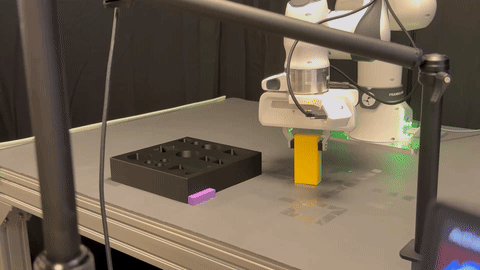

<h1 align="center">FLASH Policy</h1>

Official repository of **FLASH: Efficient Visuomotor Policy via Sparse Sampling**.

**Accepted at [NeurIPS 2026](https://neurips.cc/Conferences/2026) (Poster).**

[[Project page]](https://b1ue-jay.github.io/FLASH/)
[[Paper]](https://arxiv.org/abs/2605.15492)

Jiaqi Bai<sup>&#42;</sup>,
Jindou Jia<sup>&#42;</sup>,
Yuxuan Hu,
Gen Li,
Xiangyu Chen,
Tuo An,
Kuangji Zuo,
Jianfei Yang<sup>†</sup>

MARS Lab, Nanyang Technological University, Singapore

<sup>&#42;</sup> Equal contribution · <sup>†</sup> Corresponding author

<p align="left">
  <a href="https://b1ue-jay.github.io/FLASH/#demos">
    
  </a>
</p>

*Real-world Insert Cube with FLASH Policy.*

The implementation builds on [RoboVerse](https://github.com/RoboVerseOrg/RoboVerse) for simulation, demonstration processing, and imitation learning.

FLASH represents action trajectories with Legendre polynomial coefficients and learns a flow from coefficients fitted to the observed history to future trajectory coefficients. Sparse temporal sampling extends the execution horizon, and polynomial differentiation provides analytic velocity targets. The FLASH policy combines flow matching with only one inference step.

## Implementation

| Component | Source |
| --- | --- |
| FLASH policy | `roboverse_learn/il/policies/flash/flash_policy.py` |
| FLASH-G policy | `roboverse_learn/il/policies/flash/flash_g_policy.py` |
| Polynomial fitting and boundary constraints | `_build_poly_matrices` and `_apply_boundary_constraint` in the FLASH policy files above |
| Policy settings | `roboverse_learn/il/configs/policy_config/flash.yaml` and `flash_g.yaml` |
| Training and simulation evaluation | `roboverse_learn/il/il_run.sh` |
| Demonstration conversion | `roboverse_learn/il/data2zarr_dp.py` |

The repository also includes discrete action baselines and additional 2D tasks. A2A and A2A-Noise are separate policies; select `flash` to run FLASH.

## Environment setup

Create and activate a Python 3.11 environment with a name of your choice. Follow the [environment configuration guide](ENVIRONMENT.md) to install Isaac Lab and prepare the simulator assets. From the repository root, install the simulator and shared policy dependencies using:

```bash
python -m pip install -r requirements.txt
```

All commands below assume your configured environment is active. The environment's name has no effect on the code. Isaac Sim requires an accessible NVIDIA GPU, including for headless camera rendering; the configuration guide includes a CUDA check and simulator verification commands.

## Demonstrations and training

Original demonstrations, experiment outputs, and trained checkpoints are not distributed with this source release. Supply demonstrations in the metadata format produced by `scripts/advanced/collect_demo.py`, then convert them to Zarr. The [five-task reproduction guide](REPRODUCING.md) gives the collection and conversion commands for each task. The following quick-start example assumes 100 successful Stack Cube demonstrations under `./roboverse_demo/demo_isaacsim/stack_cube-test/robot-franka/success`, the default output directory of `roboverse_learn/il/collect_demo.sh`:

```bash
python roboverse_learn/il/data2zarr_dp.py \
    --task_name stack_cubeFrankaL0_obs:joint_pos_act:joint_pos \
    --expert_data_num 100 \
    --metadata_dir ./roboverse_demo/demo_isaacsim/stack_cube-test/robot-franka/success \
    --observation_space joint_pos \
    --action_space joint_pos \
    --downsample_ratio 4

bash roboverse_learn/il/il_run.sh \
    --task_name_set stack_cube \
    --sim_set isaacsim \
    --demo_num 100 \
    --policy_name flash \
    --downsample_ratio 4 \
    --num_steps 15000 \
    --checkpoint_every_n_steps 1250 \
    --train_enable True \
    --eval_enable False
```

Unless stated otherwise, the paper's experiments configure every policy on each of the five simulation tasks to train for **15,000 steps**, saving a checkpoint every **1,250 steps**. **Table 1 reports evaluation of the 10,000-step checkpoint (`10000.ckpt`).** Train with the full 15,000-step configuration before selecting this intermediate checkpoint: reducing the configured training budget to 10,000 can also change the learning-rate schedule.

The converter writes to `data_policy/` and replaces an existing dataset with the same name. The launcher expects the number in the dataset filename to match `--demo_num`. The current shared trainer rounds the requested training budget up to a whole number of epochs, so its final step count can slightly exceed 15,000. With the default gradient accumulation of one, select the saved 10,000-step checkpoint for Table 1 evaluation.

The FLASH example uses sampling ratio 4. For baseline commands using the launcher's default ratio 1, run the converter with `--downsample_ratio 1` to prepare the corresponding `ds1` dataset. The converter and launcher must use the same ratio.

### Five simulation tasks

The paper reports **three Isaac Sim tasks and two MuJoCo tasks**. Use the exact task identifiers below with `il_run.sh --task_name_set` and `collect_demo.py --task`. The paper uses short display names; the command-line identifiers select the corresponding task implementation.

| Paper task | Exact task identifier | `--sim_set` | Training demonstrations | Instructions |
| --- | --- | --- | --- | --- |
| Close Box | `close_box` | `isaacsim` | 99 | [Close Box](REPRODUCING.md#close-box) |
| Pick Cube | `pick_cube` | `isaacsim` | 100 | [Pick Cube](REPRODUCING.md#pick-cube) |
| Stack Cube | `stack_cube` | `isaacsim` | 100 | [Stack Cube](REPRODUCING.md#stack-cube) |
| Pick-Place Bowl | `libero_90.kitchen_scene1_put_the_black_bowl_on_the_plate` | `mujoco` | 40 | [Pick-Place Bowl](REPRODUCING.md#pick-place-bowl) |
| Open Drawer | `libero_90.kitchen_scene1_open_bottom_drawer` | `mujoco` | 40 | [Open Drawer](REPRODUCING.md#open-drawer) |

**MuJoCo task names:** **Open Drawer** is the kitchen scene 1 task that opens the **bottom drawer** of the cabinet. **Pick-Place Bowl** is the kitchen scene 1 task that places the **black bowl on the plate**. Pass their complete `libero_90.…` identifiers in commands; `Open Drawer` and `Pick-Place Bowl` are the names used in the paper, not registered command-line task identifiers.

Follow the [five-task reproduction guide](REPRODUCING.md) for task selection, demonstration preparation, dataset conversion, FLASH training, and evaluation of the Table 1 checkpoint.

Close Box uses **99 valid expert demonstrations for both training and evaluation setup**. In the RoboVerse collection version used for our experiments, requesting 100 demonstrations stalled on the final attempt; collection was stopped after 99 successful trajectories. The other tasks use the counts listed above. Demonstration counts are separate from the 50 evaluation rollouts.

For FLASH, Appendix B specifies sampling stride 4, Legendre degree 6, history noise standard deviation 0.5, history regularization 0.1, consistency weight 1.0, and one inference step. The policy YAML provides the latter five settings; `--downsample_ratio 4` selects the corresponding sparse dataset.

## Simulation evaluation

After configuring training for 15,000 steps, evaluate the saved intermediate 10,000-step checkpoint for Table 1:

```bash
bash roboverse_learn/il/il_run.sh \
    --task_name_set stack_cube \
    --sim_set isaacsim \
    --demo_num 100 \
    --policy_name flash \
    --downsample_ratio 4 \
    --num_steps 15000 \
    --checkpoint_every_n_steps 1250 \
    --eval_ckpt_name 10000 \
    --train_enable False \
    --eval_enable True
```

The generic launcher requests 50 rollouts. The standalone ACT trainer names step checkpoints `step_10000.ckpt`; its launcher resolves `--eval_ckpt_name 10000` to this file when a literal `10000.ckpt` is absent. Confirm that the requested checkpoint exists and check the reported load path: the shared evaluator can fall back to the latest checkpoint if the requested file is missing. Checkpoints normally remain under `il_outputs/`; setting `CHECKPOINT_ARCHIVE_DIR` to an existing absolute directory enables optional archive storage.

## Reproduction scope

These commands and the [five-task reproduction guide](REPRODUCING.md) cover demonstration preparation, dataset conversion, training, and simulation evaluation with the stated FLASH settings. The original experiment data and checkpoints are not included; runs using newly prepared demonstrations may produce different numerical results.

## License and attribution

The repository includes the Apache License 2.0 in [LICENSE](LICENSE). Preserve the separate licenses and attribution notices in copied third-party components. Simulator assets and external datasets have their own distribution terms. [CONTRIBUTORS.md](CONTRIBUTORS.md) records upstream RoboVerse contributors.

## Citation

The paper has been accepted at NeurIPS 2026 as a poster. Until the final proceedings record is available, the entry below records its acceptance status and links to the arXiv manuscript.

```bibtex
@inproceedings{bai2026flash,
  title = {FLASH: Efficient Visuomotor Policy via Sparse Sampling},
  author = {Bai, Jiaqi and Jia, Jindou and Hu, Yuxuan and Li, Gen and Chen, Xiangyu and An, Tuo and Zuo, Kuangji and Yang, Jianfei},
  booktitle = {Advances in Neural Information Processing Systems},
  year = {2026},
  note = {Accepted at NeurIPS 2026 (Poster)},
  eprint = {2605.15492},
  archivePrefix = {arXiv},
  primaryClass = {cs.RO},
  url = {https://arxiv.org/abs/2605.15492}
}
```
